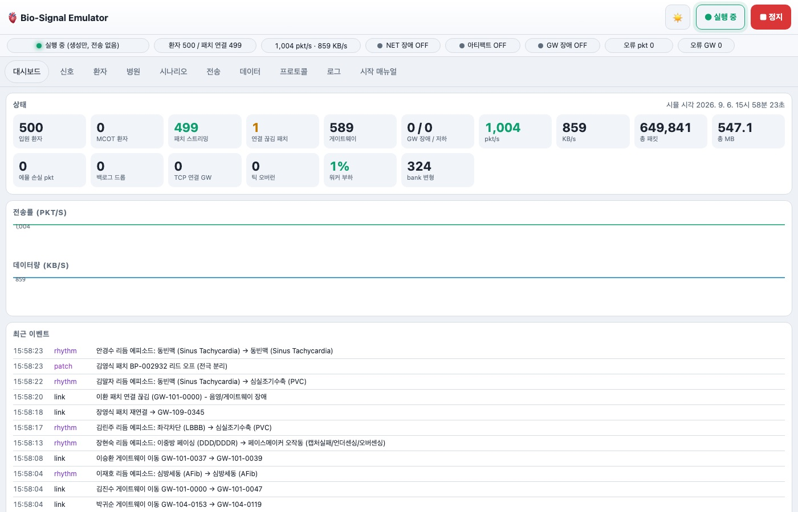
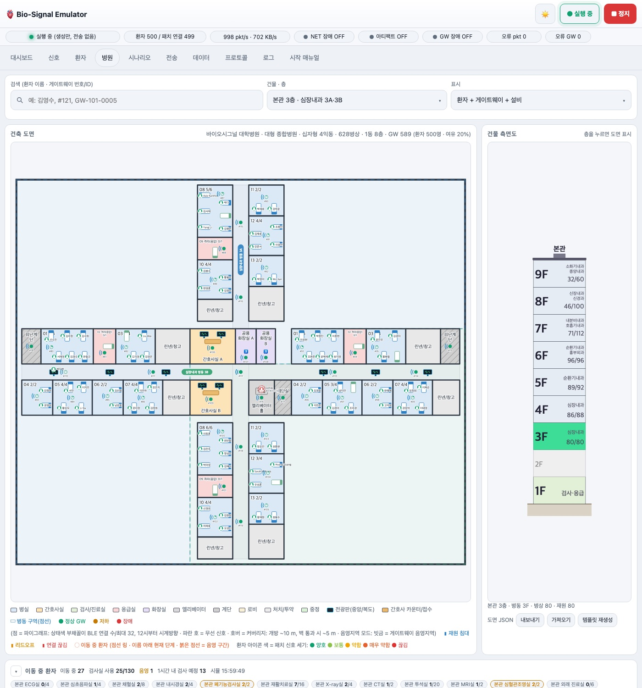
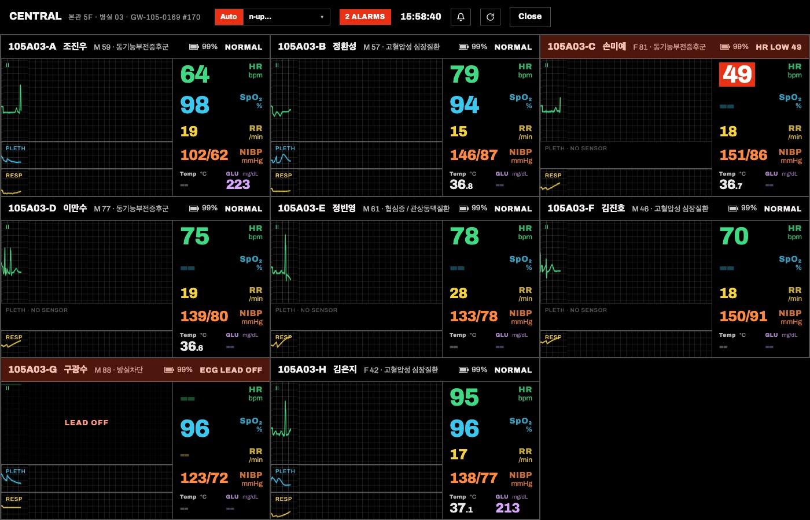
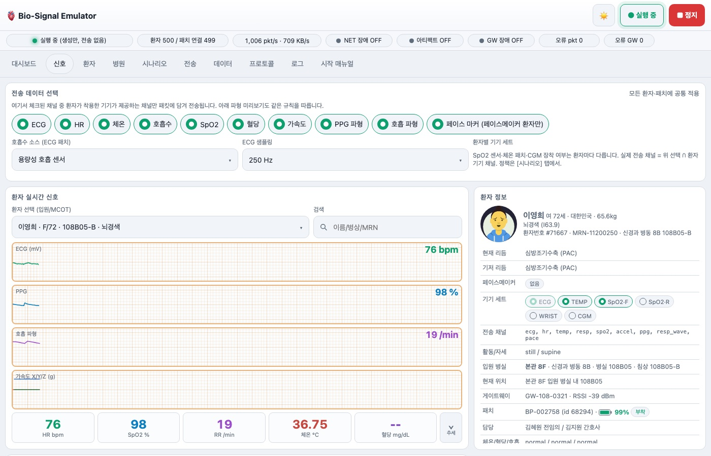
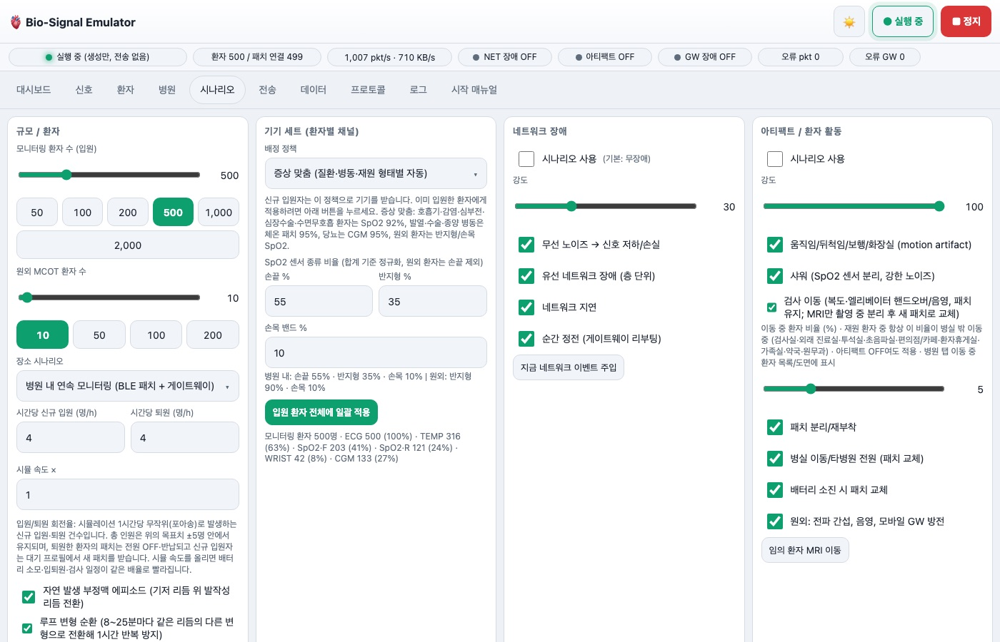
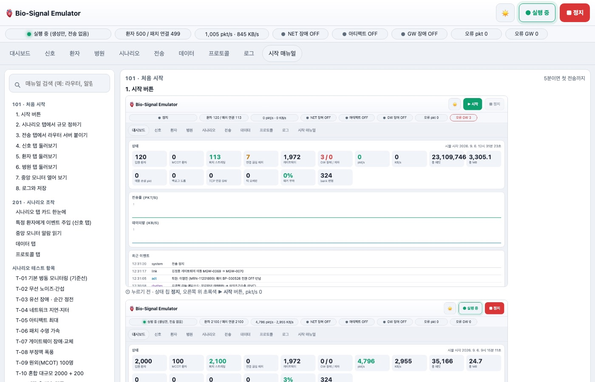

# Bio-Signal Emulator (1단계: Bio-Signal Generator)

> **Bio-Signal Emulator** is an open-source hospital-scale vital-sign traffic generator: thousands of simulated patients wearing
> ECG/SpO₂ patches, a procedurally generated hospital with BLE gateways on every floor, and a binary streaming protocol that a
> router/collector server can be developed and load-tested against, on a Raspberry Pi 4 or any Linux/macOS box.

라즈베리파이 4 / reTerminal 에서 동작하는 대규모 생체신호 입력 에뮬레이터입니다.
1만 명 환자 프로필·병원 물리 모델·BLE 패치/게이트웨이 시나리오를 만들고, 게이트웨이별 TCP 소켓으로
200 ms 단위 바이너리 프레임을 라우터 서버에 전송합니다. 웹 제어판(반응형, 터치 친화)과
라우터가 자기 설정을 결정할 수 있는 진입점(디스커버리) API, EMR 에뮬레이션 API를 제공합니다.

```
python3 -m venv .venv && . .venv/bin/activate
pip install -r requirements.txt
python run.py --pregen          # 1시간 루프 파일 은행 생성 (최초 1회, Pi4 약 5~10분)
python run.py --port 5445       # 웹 GUI: http://<pi-ip>:5445
python tools/receiver.py --port 9100 [--save DIR]   # 참고용 수신기(라우터 구현 레퍼런스)
```

## 화면 한눈에 보기

| 대시보드 | 병원 탭 (건축 도면 · 이동 중 환자 · 게이트웨이) |
|---|---|
|  |  |
| 전송률·데이터량·이벤트 로그. 오른쪽 위 ▶ 시작 한 번이면 2000명 스트리밍이 시작됩니다. | 층별 도면 위에 침대 점유, 이동 중 환자(점선 링, 넘버 배지), 게이트웨이 상태와 커버리지·음영지역을 보여 주고, 아래 목록에서 환자·게이트웨이를 바로 엽니다. |

| Central Station (게이트웨이 클릭) | 신호 탭 |
|---|---|
|  |  |
| 게이트웨이에 연결된 환자들의 ECG·Pleth·Resp 파형과 HR/SpO₂/RR/NIBP/Temp/GLU를 2×1부터 16×10까지 n-up으로. 타일을 누르면 단일 침상 뷰어가 열립니다. | 환자 한 명의 실시간 파형·수치와 리듬/이벤트 주입, 아티팩트·리드오프 스위치. |

| 시나리오 탭 | 시작 매뉴얼 (101/201/301) |
|---|---|
|  |  |
| 환자 수 프리셋, 병원 규모(환자 수 기준 자동), 네트워크/아티팩트/게이트웨이 장애 시나리오, 라우터 테스트 드릴과 스크립트. | 왼쪽 목차 + 검색, 단계별 화면과 "이 설정 적용" 버튼이 있는 T-01~T-14 시나리오 테스트 항목. |

**무엇을 할 수 있나**

* 병원 하나를 통째로 흉내 냅니다: 환자 프로필 1만 명, 건축 템플릿 10종(환자 수에 맞춰 1~3동 자동 규모 산정), 병동·검사실·엘리베이터, 이동 중 환자(검사·진료·화장실·샤워·재활·음영 구간), 입퇴원.
* 패치 신호는 1시간 루프 은행에서 memmap 슬라이스로 꺼내므로 런타임 수학이 없고, Pi 4에서도 수천 패치를 200 ms 프레임으로 내보냅니다(ECG 250/500 Hz, PPG, 호흡, 가속도, HR/SpO₂/RR/체온/혈당, 페이스메이커 펄스).
* 라우터 개발용 드릴: 무선 노이즈, 유선 장애·정전, 지연/지터, 게이트웨이 장애·교체, 저장 후 전송, 프레임 퍼징, 연결 폭주·반열림·gw_id 중복, 정답 캡처와 검증 도구(`tools/receiver.py --strict`, `tools/verify_capture.py`).
* 진입점 API(`GET /api/v1`)로 라우터가 프로토콜·채널·게이트웨이 수를 스스로 읽어 설정하고, `router/`에 2단계 라우터 서버 초안(수신·검증·패치별 저장·상태 API)이 있습니다.
* `deploy/pi/`로 라즈베리파이에 systemd 서비스로 설치하고 reTerminal 키오스크로 띄웁니다.

## 구조

| 경로 | 역할 |
|---|---|
| `emulator/config.py` | 모든 옵션(기본값·검증·`data/config.json` 저장), 채널 ID 정의 |
| `emulator/signals/ecg.py` | 비대칭 가우시안 파형 모델, 원형(모듈러) 렌더링 → 루프 이음새 완전 일치 |
| `emulator/signals/rhythms.py` | 24종 리듬 카탈로그(NSR, 서맥/빈맥, AFib/RVR, 조동, PVC/이단맥, PAC, NSVT/VT/SVT, 1·2·3도 AV차단, LBBB/RBBB, STEMI/허혈, VVI/DDD 페이싱, 동정지, VFib)와 박동 시퀀스 상태기계 (HRV: Mayer파 + RSA + VLF) |
| `emulator/signals/physio.py` | 환자-시간 번들: 호흡 → RR(RSA) → ECG(EDR 진폭변조) → PPG(PTT 지연, 펄스 결손) → HR/호흡수(3소스)/SpO2(3센서) 초당 수치 |
| `emulator/signals/slow.py`, `accel.py` | 체온(피부 패치) / CGM 혈당 / 3축 가속도 활동 템플릿 + 그에 상응하는 ECG 모션 아티팩트 |
| `emulator/signals/loops.py` | 멀티프로세스 사전 생성 → 2D `.npy` 은행(memmap, 워커 간 페이지 캐시 공유) |
| `emulator/web/static/*` | 데이터 탭: 패치 레지스트리(열 머리글 정렬은 서버 정렬 `GET /api/v1/emr/patches?sort=&dir=`로 전체 페이지에 걸침), SQLite 콘솔(조회된 최대 200행 안에서 클라이언트 정렬), 루프 은행 카드 접기/펴기 |
| `emulator/hospital/*` | 한국식 이름(출생 연대별 작명 경향)/외국인, 질환-리듬 매핑, 병원 층 도면·병실·게이트웨이·의료진·검사 일정, python-avatars 매칭 |
| `emulator/runtime/state.py` | 공유메모리 struct-of-arrays 테이블(패치/게이트웨이/통계/제어) |
| `emulator/runtime/fastpath.py` | 200 ms 틱: 벡터화 샘플 수집 → numpy 구조체 배열로 레코드 패킹 → 논블로킹 소켓 전송(지연 힙, 손실, 백로그 드롭 집계) |
| `emulator/runtime/world.py` | 1 Hz 시나리오 엔진: 입퇴원, 활동/이동/검사, 패치 수명(배터리·리드오프·교체·반납), 게이트웨이 장애/핸드오버/용량, 네트워크 이벤트, MCOT 가정 시나리오, 부정맥 에피소드, 자동 최적화 |
| `emulator/app.py` | FastAPI: `/api/v1`(디스커버리), `/api/v1/emr/*`, `/api/v1/control/*`, `/api/v1/status`, `/ws/live` |
| `emulator/web/static` | 반응형 웹 제어판 (탭 + 좁은 화면에서 드롭다운 메뉴, 44px 터치 타깃) |

## 속도 최적화 (Pi 4 기준)

* 런타임에 수학 계산을 하지 않습니다. 모든 파형은 1시간 루프 은행에서 **memmap 슬라이스**로 꺼내며, 환자마다 변형·시작 오프셋·게인·노이즈 오프셋·활동 템플릿을 조합해 조합적으로 서로 다르게 보입니다.
* 틱마다 전체 활성 패치의 ECG/PPG/호흡/가속도를 **한 번의 fancy-indexing**으로 수집하고, 레코드는 numpy 구조체 dtype으로 `tobytes()` 한 번에 만듭니다(패치당 파이썬 루프 없음).
* 게이트웨이는 워커 프로세스에 라운드로빈 분배(기본 CPU-1개). 통계·상태는 공유메모리로만 교환합니다.
* 이 Mac에서 2000명/928 GW: 워커당 build 4 ms + send 1.5 ms / 200 ms (부하 ≈3 %), 오버런 0. Pi 4(워커 3)는 4~5배 느리다고 보면 30 % 내외로 예상되며, [전송] 탭의 **자동 최적화**로 실제 안정 최대 채널 수를 찾을 수 있습니다.
* Pi 권장: `ecg_fs=250`, `variants_per_rhythm=8~12`, 라우터 측 `sysctl -w net.core.somaxconn=4096`, `ulimit -n 65535` (게이트웨이당 소켓 1개).

## 라즈베리파이 배포 (`deploy/pi/`)

`deploy/pi/build_release.sh`로 릴리스 tarball을 만들고(`--with-bank`로 루프 은행 포함 가능), Pi에서 `sudo install.sh`로 설치합니다. 코드 `/opt/biosim/app`, venv `/opt/biosim/venv`(piwheels), 데이터 `/var/lib/biosim`, systemd 서비스 `biosim`, sysctl/파일 한도 튜닝, reTerminal 키오스크(`--kiosk`)까지 포함하며 `deploy/pi/update.sh user@pi`로 코드만 갱신합니다. Pi 기본 설정은 `deploy/pi/config.pi.json`(환자 500명, ECG 250 Hz, 변형 8, 워커 3). 자세한 절차는 `deploy/pi/README.md`.

**자원 상한과 정리** (2026-09-06): 템플릿 재생성·병원 재구성은 엔진의 읽기/쓰기 잠금 아래에서만 실행되어(요청 스레드는 읽기, 재구성은 쓰기) 공유메모리 배열이 교체되는 순간 API 요청이 옛 배열을 읽던 SIGSEGV가 사라졌습니다. 저장 후 전송 버퍼는 게이트웨이당 2 MB 외에 워커당 `transport.saf_worker_max_mb`(기본 64 MB) 상한이 있고, 정답 캡처는 `transport.capture_max_mb`(기본 256 MB, 워커 합계)에 닿으면 탭이 스스로 꺼집니다. 시작 시 `general.db_retention_days`(기본 7일)보다 오래된 반납 패치·퇴원 입원·이벤트가 DB에서 정리되고, 메모리에는 활성 패치와 최근 반납 2만 건까지만 올립니다. `/api/v1/status`는 1 Hz 폴링용이라 300개 이력을 싣지 않고(`/api/v1/stats`에만 포함) `world_step_ms`(월드 1초 스텝 소요, 최대치 감쇠)를 함께 줍니다. 월드 루프는 절대 시각 기준 1 Hz이며 패치 이벤트 DB 기록은 초당 한 번 배치입니다.

**환자 수 즉시 맞춤 · 도면 부분 갱신 · 압축** (2026-09-06): 시나리오 환자 수를 바꾸면 초당 최대 500명씩 즉시 퇴원/입원해 몇 초 안에 목표에 맞춥니다(시간당 입퇴원율은 그 위의 자연 변동). 병원 탭 도면은 정적 레이어(방·복도·설비·라벨)를 층/모드/테마별로 한 번만 만들고 6초마다 침대·이동 환자·배지·게이트웨이 레이어만 교체합니다. API 응답은 2 KB 이상이면 gzip으로 나가며(게이트웨이 목록 199 KB → 19 KB), 프레임 빌더는 게이트웨이별 바이트 범위를 numpy로 한 번에 계산해 게이트웨이당 ndarray 슬라이스가 없습니다(엄격 수신기로 388 GW·499 패치 무이상 확인).

## 스트림 프로토콜 (v2, little-endian)

```
Frame  : magic u16 0x4742 | ver u8 | flags u8 | gw_id u32 | seq u32 | ts_ms u64 | n_rec u16 | payload_len u32
flags  : 0x01 META(JSON) 0x02 GW_STATUS 0x04 KEEPALIVE
payload: [GW_STATUS 12B] [META u32 len + JSON] [record × n_rec]
Record : patch_id u32 | patient_id u32 | seq u32 (패치별 패킷 순번) | flags u8 | battery u8 | rssi i8 | n_ch u8 | channel × n_ch

두 종류의 순번이 있습니다. 헤더의 `seq`는 **게이트웨이 프레임** 순번이라 게이트웨이→라우터 구간의 유실을, 레코드의 `seq`는 **패치가 자기 패킷마다 붙이는 순번**이라 패치→게이트웨이(BLE)→라우터 전체 구간에서 어느 패치의 몇 번째 패킷이 사라졌는지를 알려 줍니다. 저장 후 전송 재전송은 원래 번호를 그대로 갖고 오고, 페이스메이커 스파이크 레코드는 같은 프레임의 데이터 레코드와 같은 번호입니다. 엄격 수신기·검증 도구·라우터는 `patch_seq_gap/missing/dup/reorder`로 집계하고 라우터의 패치별 index.json에 `lost`가 누적됩니다.
Channel: ch_id u8 | dtype u8 | n u16 | data
```
채널: 1 ECG(int16, 0.001 mV) 2 HR 3 체온(int16, 0.01 °C) 4 호흡수 5 SpO2 6 혈당(uint16, 0.1 mg/dL) 7 가속도(int16×3, 0.001 g) 8 PPG 9 호흡파형 10 페이스마커.
수치 채널은 초당 1회, 패치별로 프레임을 엇갈려 보냅니다. META 블록은 재연결 직후와 `meta_every_n_frames` 마다(게이트웨이별 시차) 채널 구성·패치↔환자 매핑을 실어 나릅니다.
전체 명세는 `GET /api/v1` 의 `stream_protocol` 로 기계가독 형태로 제공되며, `tools/receiver.py` 가 디코더 레퍼런스입니다.

## 시나리오 요약

* **장소**: 병원(BLE 패치+병실/복도/엘리베이터/계단/화장실/샤워실/검사실 게이트웨이), 원외 MCOT(모바일 게이트웨이, 배터리 방전/충전, 외출·음영·전파간섭, 패치 탈락), 혼합.
* **네트워크**(기본 무장애): 무선 노이즈(손실+지연+WAN RSSI 저하), 유선 장애(층 단위 다운), 지연, 순간 정전(재부팅·uptime 리셋·CPU 스파이크). 강도 0~100.
* **패치**: 14일 배터리(시뮬 속도 배율 적용), 리드오프, 교체(배터리/병실 이동/전원/MRI), 퇴원 시 전원 OFF·반납, 교체 시 새 patch_id + NEW_PATCH 플래그. **패치 레지스트리**(`/emr/patches`)가 발급된 모든 패치를 보관합니다: 시리얼·patch_id 단조 증가(재사용 없음), 발급/종료 시각과 사유, 사용 중/사용 완료 상태, 종료 시 배터리.
* **전극 과도 현상**: 분리 순간 3초간 레일 사이를 오가는 큰 요동 뒤 레일 포화(리드오프), 부착 후 약 20초 동안 전극-피부 임피던스 안정화(환자별 3~8 mV 오프셋이 6~12초 시정수로 감쇠, ADC 포화, 기저선 요동·노이즈 감소)와 8초간 HR/RR 무효(모니터 탐색 상태).
* **게이트웨이**: 최대 32 연결, 장애 시 연결 패치 동시 끊김 → 가장 가까운 여유 게이트웨이로 재접속 → 복구 시 자동 복귀, CPU/MEM/NET/온도/uptime 리소스 상태.
* **아티팩트**: 뒤척임·보행·화장실·샤워(SpO2 센서 분리)·재활 운동·떨림·검사 이동(복도·엘리베이터 핸드오버와 음영, 패치는 유지; MRI만 촬영 중 분리 후 새 패치로 교체)·병실 이동·타병원 전원. 가속도와 ECG 아티팩트는 같은 활동 템플릿에서 나와 물리적으로 일관됩니다.
* **환자별 기기 세트**: ECG 패치(항상) + 체온 패치 + SpO2 센서(손끝/반지형/손목 PTT 밴드 중 하나) + CGM. 정책 `auto`(증상 맞춤: 호흡기·감염·심부전·심장수술·수면무호흡 → SpO2 92 %, 발열·수술·종양 병동 → 체온 95 %, 당뇨 → CGM 95 %, 원외는 반지형/손목), `all`, `minimal`. 전송 채널 = 전역 선택 ∩ 기기 채널이며 패치마다 다른 레코드 구조로 패킹되고 META `patches[].devices/channels` 에 실립니다. `/emr/devices`, `POST /emr/patients/{id}/devices`, `POST /control/devices/apply`.
* **다일 변동 모델** (`signals/trend.py`): 1시간 루프 위에 환자별 일주기 변동(주간 심박·호흡 상승, 저녁 체온 상승, 야간 SpO2 저하와 수면무호흡 가중, 07:30/12:30/18:30 식후 혈당)과 6~71시간 주기의 완만한 드리프트를 더합니다. 심박 계수는 ECG/PPG 루프 재생 속도(선형 보간)에 그대로 적용되어 파형과 HR 수치가 일치하며, 같은 모델을 `GET /signals/trend/{id}?days=1|2|3` 이 사용하므로 추세 그래프와 전송 데이터가 정합됩니다.
* **루프 변형 순환**: 환자마다 8~25분 간격으로 같은 리듬 중 평균 심박이 비슷한(±12 bpm) 다른 변형으로 1초 크로스페이드 전환하고, 체온·혈당 루프도 30~90분마다 같은 프로필의 다른 루프로 바꿉니다. 여기에 진폭 드리프트(±8 %)와 다일 변동 모델이 겹쳐 어떤 환자도 같은 1시간 구간을 두 번 재생하지 않습니다(`scenario.variant_hopping`).
* **리듬 에피소드**: 기저 질환에 맞는 발작성 리듬으로 1초 크로스페이드 전환 후 복귀.
* **삽입형 기기(페이스메이커) 모델**: 심장환자의 약 6 %(설정 가능)가 기기를 가지며 실제 분포에 맞춰 이중방 DDD/DDDR(52 %), 단일심실 VVI/VVIR(20 %), ICD(10 %, 백업 페이싱만이라 파형은 고유 리듬), CRT-P/D(11 %), 리드리스(5 %), 단일심방 AAI(2 %)로 배정됩니다. 질환에 따라 유형이 달라지고(방실차단→이중방, 영구 AF→단일심실/리드리스, 심부전→CRT/ICD), 리드 극성은 바이폴라 약 90 % / 유니폴라(구형·심외막) 약 10 %입니다.
  * 파형: 스파이크는 루프 은행에 굽지 않고 런타임에 환자별로 얹습니다. 유니폴라 2~8 mV(선명), 바이폴라 0.08~0.5 mV, 리드리스 0.05~0.25 mV(거의 안 보임). 극성은 리드 벡터에 따라 환자별 고정.
  * 동작: 센싱→억제, 융합/의사융합 박동, AV 지연 후 심실 페이싱(AS-VP), 심방 페이싱+고유 전도(AP-VS), 양쪽 페이싱(AP-VP), CRT의 RV/LV 이중 스파이크와 중간 폭 QRS, 속도반응(xxxR) 센서 레이트 상승, 영구 AF 위의 VVI(불규칙 고유 박동과 페이싱 혼재).
  * 오작동 리듬(5 % + 에피소드): 캡처 실패(스파이크만 있고 QRS 없음), 언더센싱(고정 주기 발사, T파 위 스파이크), 오버센싱(페이싱 억제로 인한 휴지).
  * 페이스 마커 채널(CH 10)은 패치 하드웨어의 페이스 검출을 흉내내어 유니폴라 99 %, 바이폴라 93 %, 리드리스 86 % 확률로 마커를 보냅니다(uint16: 하위 14비트 오프셋, 상위 2비트 심방/심실/LV). META의 `patches[].pacemaker` 에 유형·모드·리드·검출률이 실립니다.

## 시작 매뉴얼 탭

GUI 마지막 탭 "시작 매뉴얼"은 왼쪽 목차(검색 가능) + 오른쪽 본문 구조로, 화면 캡처(`emulator/web/static/guide/*.jpg`, 헤드리스 Chrome으로 `?tab=…` 딥링크에서 생성)를 곁들여 101(처음 시작: 시작 버튼 → 시나리오 규모 → 전송 탭 라우터 설정 → 신호/환자/병원/중앙 모니터 둘러보기), 201(시나리오 조작, 이벤트 주입, 알람, 데이터·프로토콜 탭), 시나리오 테스트 항목 T-01~T-14(각 항목의 [이 설정 적용] 버튼이 `PATCH /api/v1/config` + 필요 시 트리거/스크립트를 실행해 에뮬레이터를 그 환경으로 바꿈), 301(스크립트·API·성능·테스트·배포)로 나뉩니다. 시나리오 탭의 [전체 파라미터 초기화]는 자체 확인 모달을 거쳐 `POST /api/v1/config/reset {"scope":"runtime"}`을 호출하며 구조 설정(병상 수·시드·프로필·템플릿·도면 파일·샘플링·변형 수·게이트웨이 용량)은 유지해 도면 재생성이 필요 없습니다. 딥링크: `?tab=hosp&gw=<row>&preset=2x2[&bed=<row>]`.

## 라우터 검증 드릴 (전송 계층 테스트)

라우터 서버의 파서·접속 처리·복구 로직을 검증하기 위한 장치입니다. 설정은 전송 탭 또는 `PATCH /api/v1/config`의 `transport.*`, 이벤트는 시나리오 탭 또는 `POST /api/v1/control/trigger`.

| 기능 | 동작 | 설정 / 트리거 |
| --- | --- | --- |
| 저장 후 전송 | 게이트웨이 장애·회선 단절·라우터 미접속 동안 프레임을 게이트웨이별 로컬 버퍼(기본 2 MB, 초과 시 가장 오래된 프레임 폐기)에 보관하고, 복구 후 과거 타임스탬프·연속 seq 그대로 주기당 N프레임(기본 40)씩 버스트로 재전송한 뒤 실시간 프레임을 이어 보냄 | `transport.store_forward {enabled, max_bytes_per_gw, burst_frames_per_cycle}`; 통계 `saf_bytes / saf_replayed / drop_saf` |
| 오염 프레임 주입 | 프레임 1000개당 N개를 bad_magic, bad_version, bad_len(헤더 길이 불일치), truncated(절반만 전송), oversize(payload_len 0x7FFFFFF0), garbage(프레임 사이 임의 바이트), dup(중복), reorder(순서 뒤바꿈), seq_gap(시퀀스 건너뜀), bad_record(알 수 없는 채널 ID·dtype 레코드 추가)로 변형 | `transport.fuzz {enabled, rate_per_1000, kinds[]}`; 통계 `fuzz` |
| 연결 폭주 | 모든 워커가 즉시 전 소켓을 끊고 접속 예산 제한 없이 동시에 재접속(기본은 주기당 3개로 완만화) | 트리거 `storm {duration}`; 상시는 `transport.storm_smoothing=false` |
| 반열림 연결 | TCP는 유지되지만 keepalive 포함 아무것도 보내지 않는 게이트웨이 | 트리거 `half_open {count, duration}` 또는 target |
| gw_id 중복 | 한 게이트웨이가 이웃 게이트웨이의 gw_id로 전송(복제/설정 오류 장비) | 트리거 `dup_id {duration}` |
| 정답 데이터 캡처 | 소켓에 넘긴 원본 바이트(오염 변형 전)를 `data/runtime/capture/w<worker>.bin`에 `[gw_row u32][len u32][frame]`로 기록(워커당 512 MB 상한, 라우터 대상 IP가 있을 때만) | `transport.capture.enabled`, `GET/POST /api/v1/capture`, 트리거 `capture {enabled}` |
| 시나리오 스크립트 | `scenarios/*.json`의 `{at: 초, what, target, params}` 목록을 시뮬레이션 시각에 맞춰 재생(회귀 테스트용 결정적 시퀀스) | `GET/POST/DELETE /api/v1/control/script` (`{"file": "storm_drill.json"}` 또는 인라인 items) |

검증 도구: `tools/receiver.py --strict --save-frames DIR`는 `emulator/runtime/verify.py`의 StreamChecker로 각 연결을 검사해 bad magic/version/length, garbage(재동기화), seq gap/dup/reorder, ts 역행, 알 수 없는 채널을 집계합니다. `tools/verify_capture.py --capture data/runtime/capture --received DIR`는 캡처(정답)와 수신 프레임을 (gw_id, seq) 단위로 대조해 누락·초과·바이트 불일치·순서 위반을 보고합니다(문제가 있으면 종료 코드 1). `tests/`는 pytest로 프로토콜 왕복, 모든 오염 종류의 검출, NIBP 결정성, 도면 규정, 스크립트 파일을 검사합니다: `.venv/bin/python -m pytest -q tests`.

**병원 규모 = 환자 수 기준** (`hospital.size_by_patients`, 기본 켜짐): 생성되는 병원의 병상 수는 시나리오의 모니터링 환자 수 ÷ (1 − 여유율)로 정합니다. 기본 여유율 20 %이므로 환자 500명이면 625병상, 2000명이면 2500병상 규모를 만들고, 건물은 1~3동(`hospital.max_buildings`)까지만 늘린 뒤 층수를 늘립니다. 템플릿도 그 병상 수로 자동 선택되므로 환자가 적으면 소규모 지역병원 1동 몇 층짜리가 나옵니다. 한 동은 병동 층 12개(소규모 템플릿 8개)까지 채운 뒤 다음 동을 만들고, 층 단위 반올림으로 남는 병상은 위층 병실을 "(공실)"로 비워 목표 병상 수(±1 %)에 맞춥니다(예: 500명 → 628병상 1동 9층, 1000명 → 1250병상 3동 14층, 2000명 → 2503병상 3동 20층). 병원 탭의 건축 도면 영역은 정사각형이며 건물 측면도는 그 높이에 맞춰 층 높이·글자 크기가 정해지고(최대 2.2 px/단위) 세로 가운데 정렬됩니다. 환자 수를 바꾸면 설정 응답에 `needs_rebuild`가 서고 병원 탭 제목에 "규모 불일치" 표시가 뜨며, [템플릿 재생성] 또는 [병원·환자 재구성]으로 맞춥니다. 끄면 `general.bed_capacity` 그대로의 대형 병원을 만듭니다(`/api/v1/emr/hospital`의 `sizing`에 계획/실제 병상이 나옵니다).

## 건축 도면 엔진 (`emulator/hospital/layout.py`)

병상 수에 맞춰 10종 병원 원형 중 하나가 자동 선택됩니다(설정 `hospital.template` 로 고정 가능): 소규모 단일 이중복도형(≤80), 소규모 L자형(≤140), 중소형 T자형(≤300), 중형 레이스트랙형(≤420), 중형 중정(ㅁ자)형(≤560), 대형 십자형 4익동(≤900), 대형 고층 타워형(≤1200), 대형 분산 간호(포드)형(≤1600), 대학병원 다동 레이스트랙(≤2600), 메디컬센터 Y자형 트리플 타워(≤5000). 층마다 병실 구성(1~8인실)이 섞이며 병동 코어에 간호사실(중앙 모니터 2대)·투약실·청결/오염 처치실·직원휴게실·화장실·샤워실·환자휴게실이 배치되고, 복도 전광판·엘리베이터·계단이 들어갑니다. 1층은 실제 진단부 배치처럼 메인 스트리트 양쪽에 앞·뒤 2열로 로비/접수, 심장 검사(ECG·심초음파), 채혈, 초음파, 내시경(시술·회복·세척), 폐기능, 재활, 외래 진료실 / 응급실(베이·소생실·트리아지·관찰실), 영상의학과(X-ray+조정·탈의, CT+조정·장비, MRI Zone II~IV), 심혈관조영실, 투석실, 약제부, 편의시설을 둡니다. 참고: 간호단위 유형 문헌(단일/이중복도·레이스트랙·분산 포드), 의료법 시행규칙 병실 규격(1~8인실), 영상의학 설계 지침(촬영실+조정실+장비실, MRI 구역).

**고증 근거(치수·구성)**: 다인실 병상당 6.3 m² 이상·1인실 10 m² 이상·병상 간 1.5 m 이상·신축 병실 최대 4병상(의료법 시행규칙 별표 4; 구형·요양형 원형은 6~8인실 유지, 최신 원형은 4인실 상한), 바닥면적 500 m² 이상 의료시설 복도 유효폭 3.0 m 이상(건축물의 피난·방화구조 등의 기준에 관한 규칙 제15조의2), 3층 이상 의료시설 직통(피난)계단 2개소 이상(건축법 시행령 제34조), 병실 전용 화장실(복도를 거치지 않는 접근)·35병상당 음압 격리 1인실+전실·12~16실당 투약실·청결/오염 처치실 분리(FGI Guidelines / UpCodes 요약), 간호단위 유형(단일/이중복도·레이스트랙·분산 포드, HCD·HFM), 영상의학 촬영실+조정실+장비실 및 MRI Zone II~IV(HFM 영상 설계 기준, AusHFG). 생성기는 병상 간 유효 간격 ≥1.5 m, 병상당 면적 ≥6.3 m², 층당 계단 2개소, 병동당 격리실, 병실별 전용 WC를 자동 검증 대상으로 둡니다.

**병동 구역(간호단위)**: 층마다 두 간호단위(A/B)가 진료과 단위로 나뉘며, 한 진료과는 인접한 층을 연달아 씁니다(3A·3B·4A… 순으로 채움, 한 병동이 층을 넘어 쪼개지지 않음). 각 병동은 도면 JSON의 `wards[].zones` 폴리곤(m)으로 공간이 분리되고 병실은 모두 자기 구역 안에 놓입니다(`validate()`가 검사). 템플릿별 분할: 선형/포드 = 동서, T = 좌우 바, L = 두 날개, 레이스트랙/타워/파빌리온 = 남북, 중정 = 바람개비(북+서 / 동+남), 십자 = 서+북 날개 / 동+남 날개, Y = 날개별.

**게이트웨이 배치 규칙** (`hospital.py`): 방마다 천장 게이트웨이를 중앙에 두되, 방의 모든 지점이 한 게이트웨이의 설계 도달거리 8.5 m(개방 공간 10 m에서 여유를 뺀 값) 안에 들도록 긴 축을 따라 개수를 늘립니다(26 m 응급실·투석실·재활치료실·대형 로비 = 2대). 로비·대기·휴게/카페처럼 사람이 몰리는 공간은 피크 밀도(0.2~0.3명/m²) × 패치 착용 비율 0.5 로 예상 인원을 잡아 게이트웨이당 BLE 용량의 75 %를 넘지 않도록 추가합니다. 병동에는 간호사실과 공용(장애인) 화장실이 필수이고, 1층은 로비·영상 대기·투석·내시경·외래 진료실 7개마다 화장실 블록을 둡니다. GUI의 "게이트웨이 음영지역" 표시는 벽마다 남은 거리를 절반으로 줄이는 레이 캐스팅으로 커버리지를 계산해 빗금으로 사각지대를 보여 줍니다.

**중앙 모니터 / 단일 침상 뷰어** (`ui_mockups/` 목업, Modernist 디자인 시스템 적용): 병원 탭 도면의 게이트웨이 아이콘 또는 게이트웨이 목록의 ID를 클릭하면 Central Station이 전체 화면으로 뜹니다. 검은 바탕, Archivo 서체, 0 라운드, 2 px 구분선의 12-up 스타일이며 헤더의 n-up 버튼(Auto, 2, 4, 6, 9, 12, 20, 24, 48 = 2×1, 2×2, 2×3, 3×3, 3×4, 4×5, 4×6, 6×8 열×행; 48 초과는 숫자 전용 보드 64 = 8×8, 96 = 12×8, 120 = 12×10, 160 = 16×10으로 파형 없이 HR·SpO₂·RR·NIBP 큰 숫자와 Temp·GLU 작은 줄만 표시하고 스트림도 1 Hz 숫자만 받음; 헤더는 환자 이름만 두고 리듬 코드/알람 텍스트는 숫자 영역의 상태 줄로 내려가며, 작은 타일에서는 알람 문구를 축약해(SpO₂↓87, AVB III) 칸 밖으로 나가지 않게 함)으로 격자를 고르며 Auto는 창의 가로세로 비율에 맞춰 타일 비율이 목업(≈1.55:1)에 가장 가까운 열·행을 택합니다. 고정 격자에서 침상이 칸 수를 넘으면 ‹ › 페이지 넘김이 생기고 빈 칸은 비워 둡니다(보이는 침상만 스트리밍). 타일은 항상 동일 크기이며 타일 높이·폭에서 글자 크기와 수치 열 폭을 계산합니다. 수치 행이 64 px 미만(12-up 이상)이면 라벨과 값을 한 줄로 놓고 한계값을 숨기며, 40 px 미만(20-up 이상)이면 단위도 숨겨 라벨이 10 px 이상으로 남습니다. 배치 후 실제 렌더 폭을 측정해 수치 줄이 칸을 넘으면 값 글자를 비율대로 줄이는 맞춤 패스가 한 번 더 돕니다. 타일이 작아지면(폭 380 px 미만) 헤더의 침대 번호를 빼고 환자 이름을 온전히 표시하고, 250 px 미만이면 이름과 상태만 남깁니다. 타일마다 ECG II · Pleth · Resp 파형이 3:1:1 고정 높이(없는 센서는 빈 칸), 오른쪽에 HR(녹색)·SpO₂(청색)·RR(황색)·NIBP(주황)·Temp(백색)·GLU(보라) 순으로 수치와 알람 한계, 상단에 침대·이름·성별/나이/질환·패치 배터리·상태가 놓입니다. 페이스메이커 환자는 A/V/LV 펄스 마크가 세로 점선으로 표시됩니다. 알람은 우선순위 순(적색: 신호 없음·VFib·VT·무수축·3도 차단·SpO₂<88·HR>150/<40, 황색: 리드오프·AFib/AFL/SVT/NSVT/2도 차단/페이서 이상·SpO₂<92·HR 50~120 이탈·RR 8~30 이탈·체온≥38.3·혈당 70~250 이탈·배터리≤15 %)으로 헤더와 해당 수치에 표시되고 헤더의 종 아이콘(묵음 시 빗금 종)으로 묵음/해제를 토글합니다. 타일을 클릭하면 Vitals Monitor Viewer(밝은 바탕, Night 토글)가 열려 ECG·Pleth·Resp 대형 파형, 5개 수치 타일(한계·6시간 스파크라인), 6시간 시간별 추세표, 해당 환자 이벤트를 보여 줍니다. NIBP는 패치 채널이 아니라 병동 간호 스팟체크(커프, q1h) 모델입니다(`signals/trend.py nibp()`: 나이·고혈압·신질환 기반 기저치 + 야간 저하 + 드리프트 + 측정 잡음, 환자별 측정 분(分) 고정). 게이트웨이 환자 API와 추세 API(`bp_sys/bp_dia/bp_map`)로 제공되며 프로토콜 프레임에는 포함되지 않습니다. NIBP 알람: 수축기 160 초과/90 미만 황색, 190 이상/80 미만 적색. 데이터는 `GET /api/v1/emr/gateways/{idx}/patients`와 `/ws/live`의 다중 환자 모드(`{"rows":[...]}`)로 받습니다. 게이트웨이 목록은 열 머리글 클릭으로 정렬됩니다.

도면 JSON(스키마 v1, 미터 단위 폴리곤)은 `GET /api/v1/emr/layout` 로 내보내고 `POST /api/v1/emr/layout/import` 로 가져옵니다(병원 탭 버튼). 라우터는 이 JSON으로 같은 도면을 그리고 게이트웨이·환자 배치를 재현합니다. GUI 도면은 SVG 벡터라 종횡비를 유지하며 확대·축소됩니다.

**이동 중 환자 목록** (병원 탭, 게이트웨이 목록 바로 위): `GET /api/v1/emr/trips`가 지금 이동 중인 재원 환자(검사 이동·병실 이동·화장실·보행·샤워·재활)를 남은 시간 순으로 돌려주며, 각 환자마다 현재 단계와 단계 타임테이블(완료 ✓ / 진행 ▶ / 예정 ○, 시뮬레이션 시각 기준 시작 시각과 소요)을 붙입니다. MRI는 정해진 루틴(복도 보행 → 엘리베이터 홀 대기 → 엘리베이터 이동(음영) → 로비 → MRI 촬영(패치 분리) → 로비 → 엘리베이터 → 복도 → 새 패치 부착·게이트웨이 재연결 → 병실 복귀)이 예정 단계로 모두 표시됩니다. 다음 예정 검사 3건(시각·검사실·소요·패치 분리 여부)도 함께 보이고, 카드를 접으면 헤더에 이동 인원·종류별 인원·음영 구간·MRI 패치 분리·1시간 내 검사 예정·검사실 사용 통계가 남고, 펼치면 표 위에 건물별 검사실/방문 장소의 현재 사용 인원과 수용 인원 칩이 보입니다. 행을 클릭하면 그 환자가 지금 있는 층의 도면이 열리고 마커가 5초간 깜박인 뒤 해제되며, 이름을 클릭하면 환자 탭 상세(입원 병실 · 현재 위치 · 현재 동선 타임테이블)가 열립니다. 환자 이름·현재 단계·위치·게이트웨이 열은 머리글 클릭으로 정렬되고, 카드 폭이 좁아지면 표가 카드형 2열 레이아웃으로 바뀝니다. 게이트웨이·병동 카드도 접으면 헤더에 총계(게이트웨이: 고정/모바일 수, 상태별 수, BLE 연결, TCP, 평균 지연, 평균 pkts, CPU/MEM/NET 최대 / 병동: 병동 수, 진료과 수, 병상, 재원, 빈 병상)를 보여 주며 제목 줄 어디를 눌러도 접고 펴집니다. 병원 탭이 열려 있는 동안 이동 목록은 3초, 게이트웨이·병동 목록은 9초마다 갱신됩니다. `scenario.exam_trip_ratio`(기본 5 %)는 아티팩트 시나리오와 무관하게 재원 환자 중 항상 그 비율이 병실 밖 이동 중이도록 유지하는 정원 값입니다. 부족하면 초당 몇 명씩 새 이동을 시작하며 구성은 검사 이동 44 %(환자의 다음 예정 검사를 당겨 쓰고, 없으면 빈 검사실 중 무작위, 투석은 신부전 환자만), 방문 20 %(외래 진료실 협진, 초음파실, 환자휴게실, 가족 면회, 편의점/카페, 약국, 원무과), 화장실 12 %, 복도 보행 8 %, 샤워 5 %, 재활 5 %, 병실 이동(패치 교체) 3 %, 음영 구간 진입(엘리베이터/계단실 왕복) 3 %입니다. 검사실·방문 장소는 환자가 속한 건물의 것을 우선 쓰므로 본관·별관·신관 1층이 모두 채워지고, 수용 인원·예약도 건물별로 관리됩니다. 검사 이동 경로에는 접수(30 %), 조영 CT/MRI 전 채혈 대기·채혈(35 %), 영상 대기/채혈 대기 또는 복도 대기, 검사 후 화장실(12 %), 귀환 중 카페(15 %)/약국(10 %) 같은 선택 단계가 확률적으로 섞입니다. 검사실마다 스테이션 수(병상 500당 1배)로 동시 수용 인원이 정해져 있어 예약 시각이 겹치지 않게 잡히고(현지 08~17시), 실시간에도 방이 차 있으면 2분 뒤로 미루거나 다른 빈 방을 고릅니다. 도면(환자 표시 모드)에는 이동 중 환자가 현재 방(복도·엘리베이터 홀·대기실·검사실, 음영 구간은 엘리베이터, MRI 촬영 중은 MRI실)에 점선 링과 이름·현재 단계로 표시되고 6초마다 갱신되며, 환자 상세에는 입원 병실과 현재 위치가 건물·층과 함께 따로 나옵니다. 같은 방의 여러 환자는 방 전체에 깐 격자(1.5×1.05 m, 붐비면 1.2×0.9 m)를 중앙에서 바깥 순으로 채우되 링과 이름 라벨(오른쪽이 막히면 왼쪽)이 게이트웨이 마커·방 이름·먼저 놓인 환자와 겹치는 칸은 건너뜁니다. 공간이 좁아 전원을 표기할 수 없거나 8명 이상이 모인 장소는 개별 마커 대신 인원수 넘버 배지 하나로 표시되며(게이트웨이·방 이름을 피해 배치), 배지에 마우스를 올리면 환자 목록(이름·현재 단계)이 펼쳐지고 클릭하면 그 환자가 열립니다. 게이트웨이 마커는 환자 위에 그려져 밀집한 로비에서도 항상 클릭됩니다.

**설정 이력과 실행 스냅샷**: 모든 설정 변경은 `config_history` 테이블에 시각·출처(gui/api/autotune/reset/restore)·실행 번호·경로·이전값→새값으로 남고(`GET /api/v1/config/history?path=`), 전송을 시작할 때마다 `runs.config_json`에 설정 전체 스냅샷이 저장됩니다(`GET /api/v1/runs`, `/api/v1/runs/{id}/config`). `POST /api/v1/config/restore {run_id}`는 그 실행의 시나리오 전체를, `{history_id}`는 한 항목만 이전값으로 되돌리며 PATCH와 같은 `needs_rebuild/needs_generate` 플래그를 돌려줍니다. 데이터 탭 "설정 이력" 카드에서 검색·복원할 수 있습니다. 설정 자체는 여전히 `data/config.json`이 원본입니다.

## SQLite DB (`data/emulator.db`)

`emulator/db.py` 가 환자 프로필, 입퇴원(admissions: 환자번호 = 입원마다 새로 발급되는 고유 번호), 패치 레지스트리(patches, patch_events), 검사 일정(exams), 게이트웨이 장비 이력(gateways: 하드웨어 번호 gw_no, 교체 시 새 번호·MAC), 이벤트 로그(events), 전송 실행 기록(runs)을 WAL 모드로 저장합니다. 구조 설정(시드·병상·프로필 수)이 같으면 재시작 후에도 이력이 유지되고 패치·게이트웨이·환자 번호가 이어집니다. `GET /api/v1/db/stats`, `POST /api/v1/db/query {sql}` (SELECT 전용) 로 라우터나 GUI(데이터 탭 SQL 콘솔)에서 조회할 수 있습니다. 전송 프레임의 `patient_id` 는 환자번호(admissions.id), `gw_id` 는 gw_no 입니다.

## 라우터 서버 (2단계 초안, `router/`)

`python -m router --port 9100 --api-port 9200 --data data/router --emulator-url http://localhost:5445`. 게이트웨이 TCP 스트림을 받아 프로토콜 검증기로 확인하고 패치별 시간 단위 파일(`data/router/patches/<id>/…rec`)과 게이트웨이별 META를 저장하며, `/status`·`/gateways`·`/patches`·`/anomalies` API와 에뮬레이터 상태 보고를 제공합니다. 자세한 내용은 `router/README.md`.

## 라우터 서버(2단계) 연동 포인트

1. `GET /api/v1` → 엔드포인트·프로토콜·채널·현재 설정.
2. `GET /api/v1/emr/hospital|floors/{b}/{f}|gateways|admissions|patients/{id}` → BioSignal MAP 구성(층 도면 좌표 m 단위, 게이트웨이 좌표/타입, 환자 위치·패치·게이트웨이 매핑).
3. TCP 리슨 → 프레임 수신, `patch_id` 파일로 저장 (`tools/receiver.py --save` 참고).
4. `POST /api/v1/router/status` 로 상태 보고 → 에뮬레이터 GUI에서 확인(`transport.router_status_url` 도 예약).

## 제안 / 보완이 필요한 항목

* **패치 버퍼링·백필**: 실제 BLE 패치는 끊김 동안 데이터를 내부에 저장했다가 재접속 후 back-fill 합니다. 현재는 손실로만 모델링. 필요하면 지연 프레임(플래그 BACKFILL) 추가를 권합니다.
* **시각 동기화**: 게이트웨이 클록 오차(수십 ms 드리프트)와 NTP 보정 이벤트 모델링.
* **12유도 / 다채널**: 지금은 1채널 ECG. 패치 제품에 맞게 2~3채널 벡터 ECG로 확장 가능(형태학 파라미터만 추가).
* **PPG 파형 전송**: SpO2 산출 근거로 PPG(100 Hz)를 옵션 채널로 넣어 두었습니다(기본 OFF).
* **알람 정답 데이터**: 루프 은행에 R-peak/리듬 라벨이 있으므로 라우터 알람 검증용 ground-truth API(`/emr/...` 또는 별도)를 노출하면 2단계 검증에 유용합니다.
* **보안**: 운영 시 TLS/토큰(게이트웨이 인증)은 제외되어 있습니다.
* **MCOT 위치 정보**: 원외 환자는 GPS 좌표가 없으며 `home/outside/shadow` 상태만 제공합니다.
