# Bio-Signal Emulator — 주요 기능 소개

> 병원 하나를 통째로, 라즈베리파이 한 대에서 흉내 냅니다.

Bio-Signal Emulator는 원격 환자 모니터링 시스템을 **실제 병동에 들어가기 전에** 운영 규모로 시험하기 위한 에뮬레이터입니다.
- 수천 명의 가상 환자가 ECG·SpO₂ 패치를 달고 병동과 검사실을 오갑니다.
- 층마다 설치된 가상 BLE 게이트웨이가 그 신호를 200 ms마다 수집(라우터) 서버로 보냅니다.
- 입퇴원, 패치 교체, 게이트웨이 고장, 망 장애, 부정맥 발작처럼 병원에서 실제로 일어나는 일을 재현합니다.
- 가상 의료기관 20곳의 EMR을 내장해 상용 EMR 연동도 함께 시험할 수 있습니다.

**대상**
- 원격 모니터링·수집 서버 개발팀
- 중앙 모니터·뷰어 개발팀
- 병원 정보팀·EMR 연동 담당
- 의료기기 시험 준비

---

## 한눈에 보는 수치 (운영 장비 실측)

| 항목 | 값 |
|---|---|
| 동시 모니터링 패치 | **2,050** (병원 2,000 + 원외 MCOT 50) |
| 가상 BLE 게이트웨이 | **2,124** (게이트웨이마다 TCP 연결 1개) |
| 전송량 | **3,350 패킷/초 · 2.0 MB/s** |
| 200 ms 주기 부하 | **≈13 %** (워커 3개, 주기 초과 0회) |
| 무중단 누적 | **37시간 · 5.2억 패킷 · 298 GB** |

측정 환경: Raspberry Pi 5 (Cortex-A76 4코어, 16 GB), 2026-09-26.

---

## 1. 운영 현황 대시보드

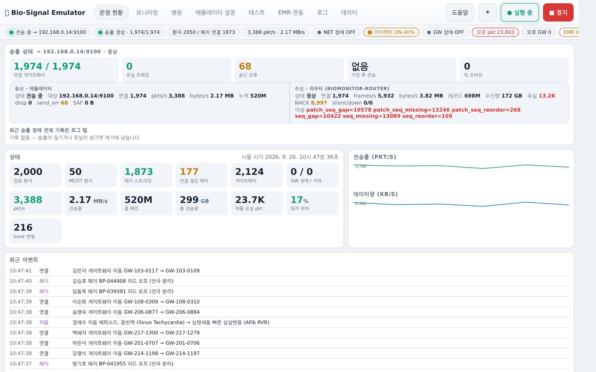

에뮬레이터가 지금 무엇을 얼마나 보내고 있는지 한 화면에 보여 줍니다.
- 송출 상태와 라우터 연결 수
- 초당 패킷·데이터량 추이
- 재원·MCOT 환자 수, 패치·게이트웨이 상태
- 네트워크·게이트웨이 장애와 아티팩트 시나리오 상태
- 오류 패킷 누적
- 라우터가 보고한 수신 상태(연결 수, 유실, 재전송)와 실시간 이벤트 로그

---

## 2. 병원 건축 도면

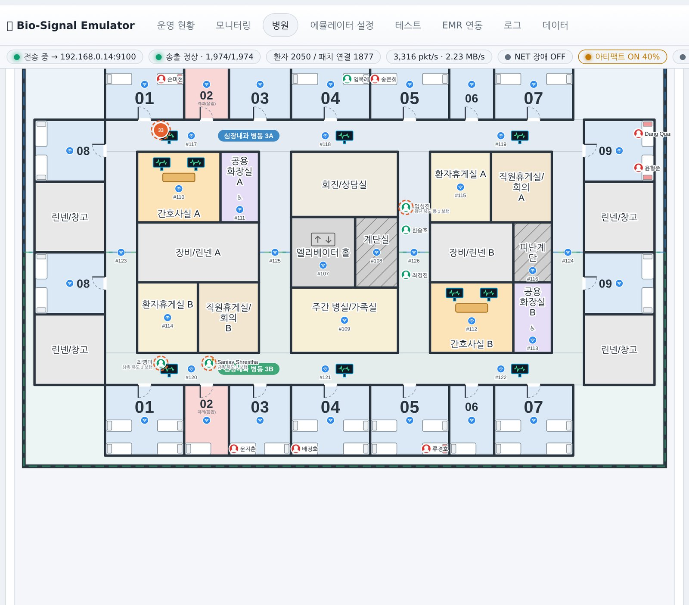

병원 규모는 모니터링할 환자 수에서 거꾸로 정해집니다. 환자 2,000명이면 약 2,500병상, 3동 20층입니다.

**건물**
- 도면 원형은 10종이며 병상 수에 맞춰 자동 선택됩니다: 단일 복도형, L·T자, 레이스트랙, 중정형, 십자 4익동, 고층 타워, 분산 포드, 대학병원 다동, Y자 트리플 타워.
- 병실 면적·병상 간격·복도 폭·직통계단 수는 국내 의료법·건축법 치수로 자동 검증됩니다.
- 병동마다 간호사실·투약실·처치실·음압 격리실이 들어갑니다.

**도면 표시**
- 병실 안의 침대 위치·방향(머리는 벽, 발은 통로 쪽), 호실 번호를 그립니다.
- 천장 중앙의 게이트웨이, 커버리지와 음영지역을 보여 줍니다.
- 이동 중인 환자와 병상 점유(전극 분리·신호 없음 강조)를 표시합니다.

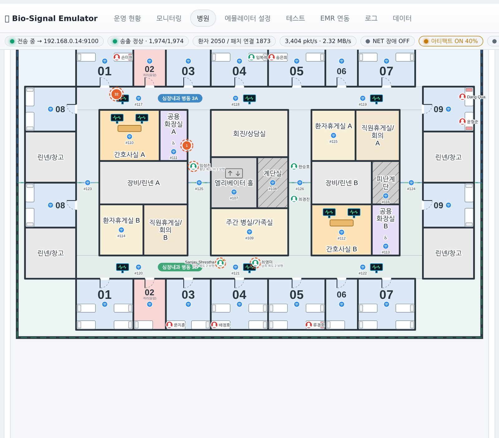

**조작**
- 건물 안을 누르면 확대되고 끌어서 이동합니다. 건물 바깥을 누르면 아무 일도 일어나지 않습니다.
- 오른쪽 건물 측면도에서 층을 고릅니다.
- 도면은 미터 단위 JSON(`GET /api/v1/emr/layout`)으로도 내보내므로, 라우터 뷰어가 같은 도면을 그릴 수 있습니다.

---

## 3. 중앙 모니터 (Central Station)

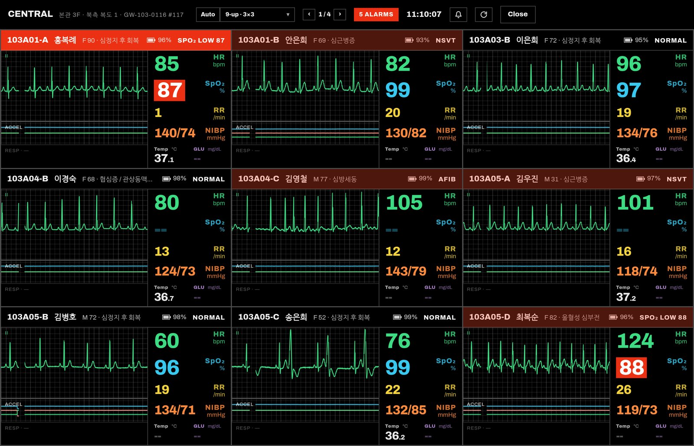

도면에서 게이트웨이를 누르면 그 게이트웨이에 연결된 환자들의 중앙 모니터가 열립니다.

**타일 한 칸에 보이는 것**
- 파형: ECG II · Pleth · Resp
- 수치: HR · SpO₂ · RR · NIBP · Temp · GLU와 알람 한계
- 패치 배터리, 리듬 상태
- 경보는 우선순위별 색으로 표시되고 헤더의 종 아이콘으로 묵음 처리합니다.
  - 적색: VFib, VT, 3도 차단, SpO₂ < 88 등
  - 황색: 리드오프, AFib, SpO₂ < 92 등

**격자**
- 2×1부터 6×8까지 고를 수 있습니다.
- 병동 전체를 한 번에 보는 숫자 전용 보드는 최대 16×10(160침상)입니다.

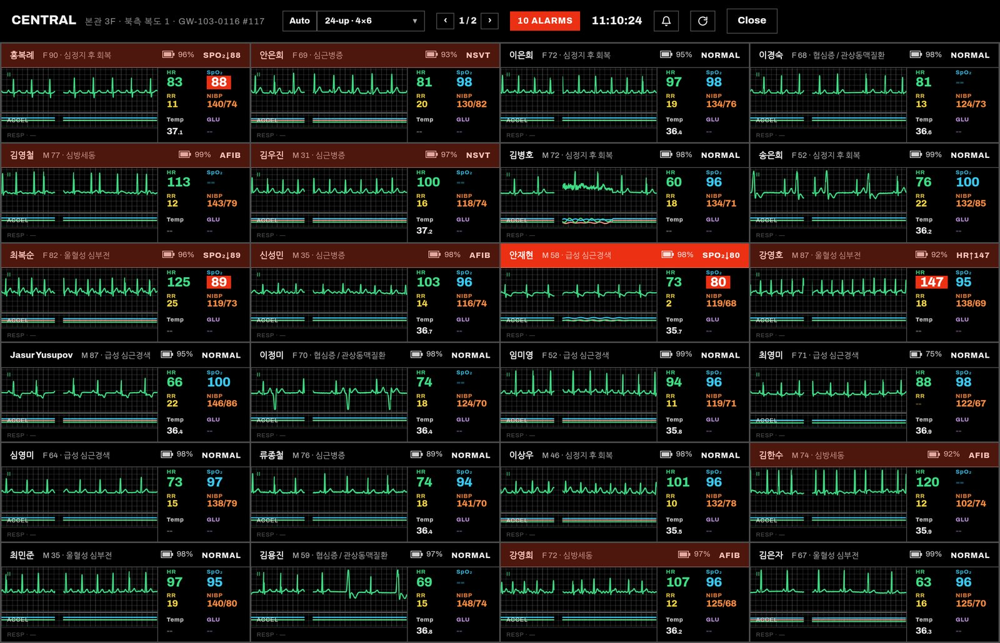

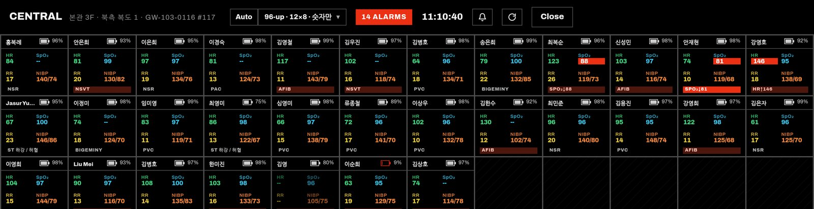

---

## 4. 단일 침상 뷰어 (Vitals Monitor Viewer)

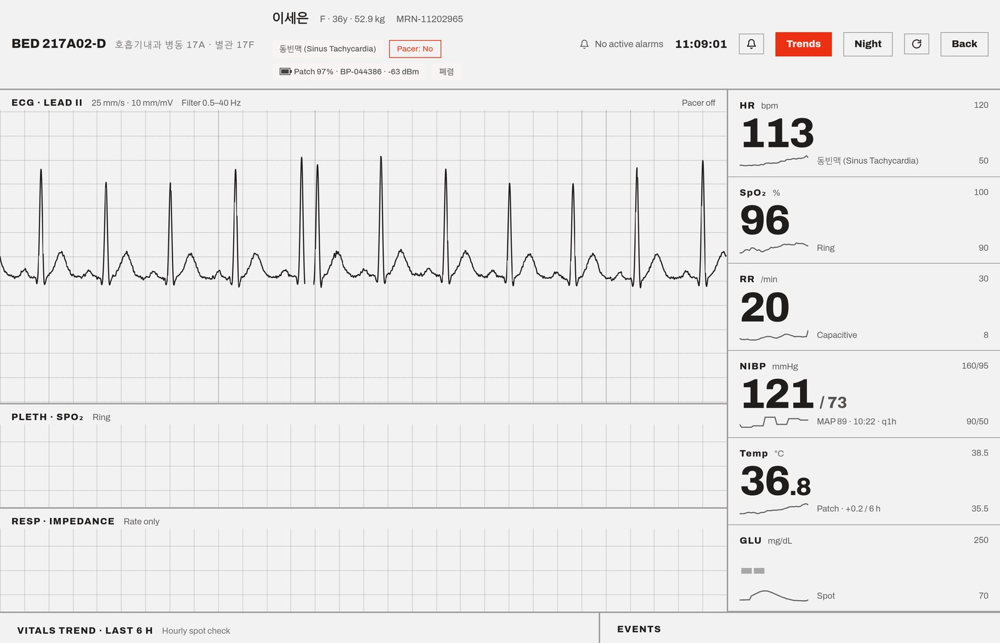

중앙 모니터의 타일을 누르면 한 환자의 병상 모니터가 열립니다.
- 표준 표시: 25 mm/s · 10 mm/mV
- 큰 수치 타일에 알람 한계와 6시간 스파크라인이 붙습니다.
- 아래에 6시간 추세표와 해당 환자 이벤트가 이어집니다.
- 밝은 화면과 야간(Night) 모드를 전환할 수 있습니다.

NIBP는 패치 채널이 아니라 병동 간호 스팟체크(커프, 1시간 간격) 모델로 제공합니다.

> 캡처 당시 운영 설정에서 선택 채널인 PPG·호흡 파형 송출이 꺼져 있어 Pleth·Resp 칸이 비어 있습니다. 수치(SpO₂, RR)는 그대로 전송됩니다.

---

## 5. 환자 모니터링

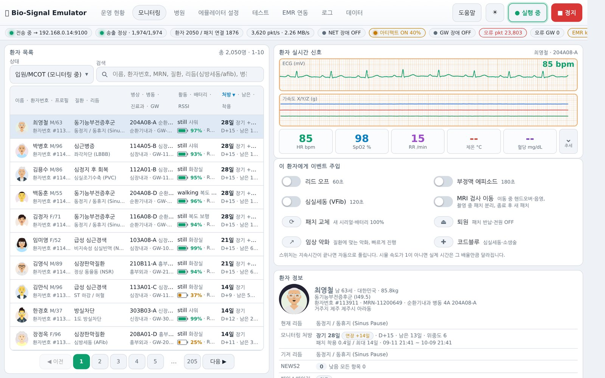

**환자 목록**
- 이름·환자번호·진단·리듬·병상·게이트웨이·기기 세트·배터리·RSSI
- **모니터링 처방**: 처방 일수, D+n, 남은 시간, 패치 착용일

**환자를 고르면**
- 실시간 ECG와 수치
- 리듬·에피소드·리드오프 주입 스위치
- NEWS2 조기경보 점수
- 입원 기록·검사 일정·이동 동선·패치 교체 이력

**모니터링 처방 모델**
- 부착 때 위중도에 따라 처방합니다: 단기 3~5일 · 중기 7일 · 장기 14일.
- 패치는 최대 14일 착용하고 배터리는 15.5일입니다. 교체되면 새 패치 번호를 받습니다.

---

## 6. EMR 연동 시험

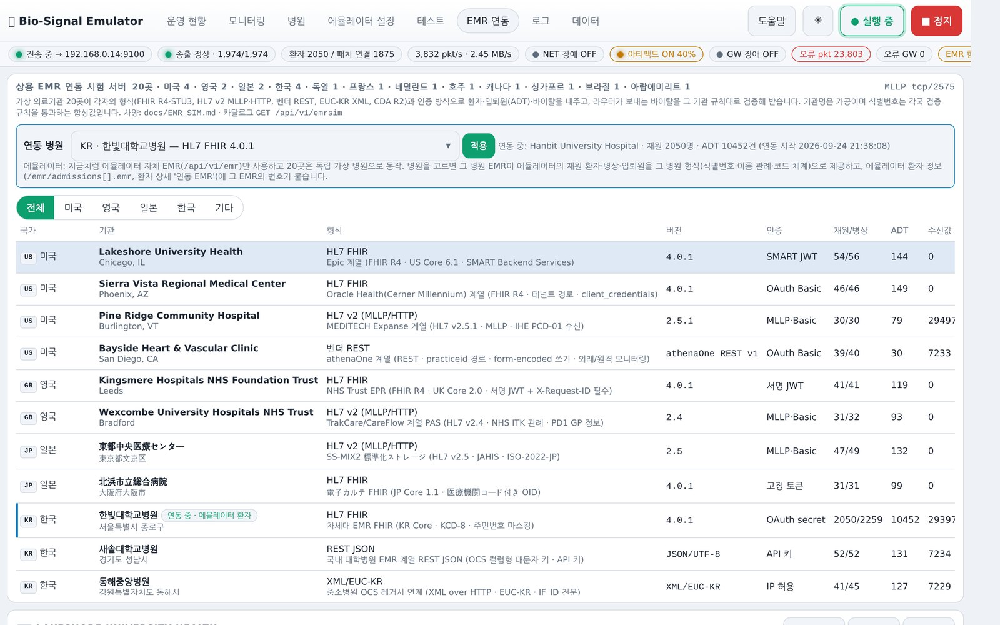

상용 EMR 연동을 미리 시험할 수 있도록 **가상 의료기관 20곳**을 내장했습니다.

| 국가 | 기관 수 | 형식 |
|---|---|---|
| 미국 | 4 | FHIR R4 · US Core (2곳), HL7 v2.5.1 MLLP + IHE PCD-01, 외래 REST |
| 영국 | 2 | FHIR R4 · UK Core, HL7 v2.4 (NHS ITK) |
| 일본 | 2 | SS-MIX2 HL7 v2.5 (ISO-2022-JP), FHIR R4 · JP Core |
| 한국 | 4 | FHIR R4 · KR Core, 대학병원식 REST JSON, EUC-KR XML 전문, 진료정보교류 CDA R2 |
| 기타 | 8 | 독일 ISiK, 프랑스 IHE PAM FR, 네덜란드 FHIR STU3, 호주 AU Core, 캐나다 HL7 v2.3, 싱가포르, 브라질 RNDS, UAE Malaffi |

**형식과 인증**
- 인증 방식은 10가지입니다: SMART JWT, client_credentials, API 키, 인증서 등.
- 식별번호(NHS·BSN·CPF·IHI·NRIC·Emirates ID·주민번호 등)는 각국 체크 디지트 규칙을 통과하는 합성값입니다.

**연동 병원 선택**
20곳 중 하나를 고르면 그 병원 EMR이 에뮬레이터의 실제 재원 환자·병상·입퇴원을 자기 형식으로 내줍니다.

**시험 도구**
기관마다 자체 시험, 예시 요청, 장애 주입(지연·5xx·다운·토큰 만료), 요청 로그, 수신 바이탈 기록을 제공합니다.

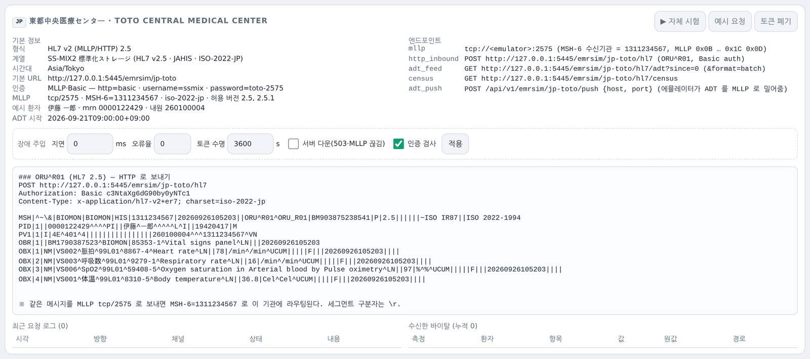

---

## 7. 시나리오

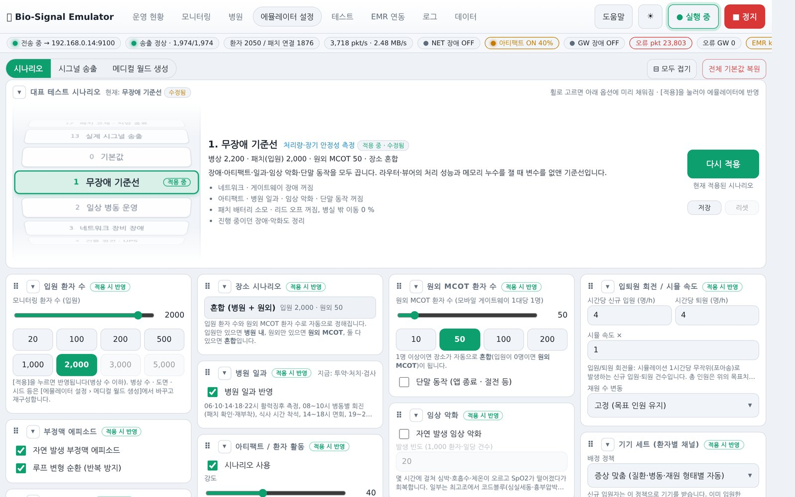

**대표 시나리오 14개**는 휠에서 골라 한 번에 적용합니다.

| 프리셋 | 무엇을 시험하나 |
|---|---|
| 무장애 기준선 | 처리량과 장기 안정성 |
| 일상 병동 운영 | 요일·시간대 재원 곡선, 병원 일과 |
| 네트워크 장비 장애 | 스위치·AP 장애, 버퍼링·재전송 |
| 건물 정전 · UPS | 대량 동시 단절과 순차 복구 |
| 게이트웨이 장애 · 교체 | 무응답·성능 저하·새 번호 재접속 |
| 움직임 · 아티팩트 최대 | 신호 품질 판정 |
| 임상 악화 · 코드블루 다발 | 조기경보·부정맥 분석(정답 라벨) |
| 원외 MCOT 중심 | 모바일 회선·단말 끊김 |
| 라우터 내구성 | 오염 프레임·연결 폭주·반열림 연결 |
| 퍼포먼스 | 최대 부하 |
| 전파 방해 (2.4 GHz) | BLE 잦은 끊김 |
| 패치 교체 · 처방 종료 | 새 패치 번호·반납·새 부착 |
| 실제 시그널 송출 | 실측 심전도 파일 반복 전송 |

개별 사건은 트리거·스크립트로 원하는 시각에 주입합니다. 모든 설정 변경은 이력으로 남고 실행 단위로 되돌릴 수 있습니다.

---

## 8. 시그널 송출 · 메디컬 월드 생성

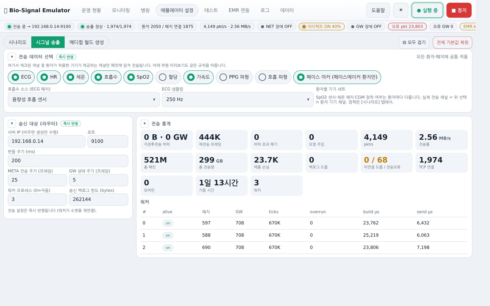

**시그널 송출**
- 라우터 주소와 전송 채널을 정합니다.
- 저장 후 전송, 오염 프레임, 정답 캡처 같은 드릴을 켭니다.
- 실측 심전도 파일(ATF/CSV)을 올려 그대로 송출합니다.

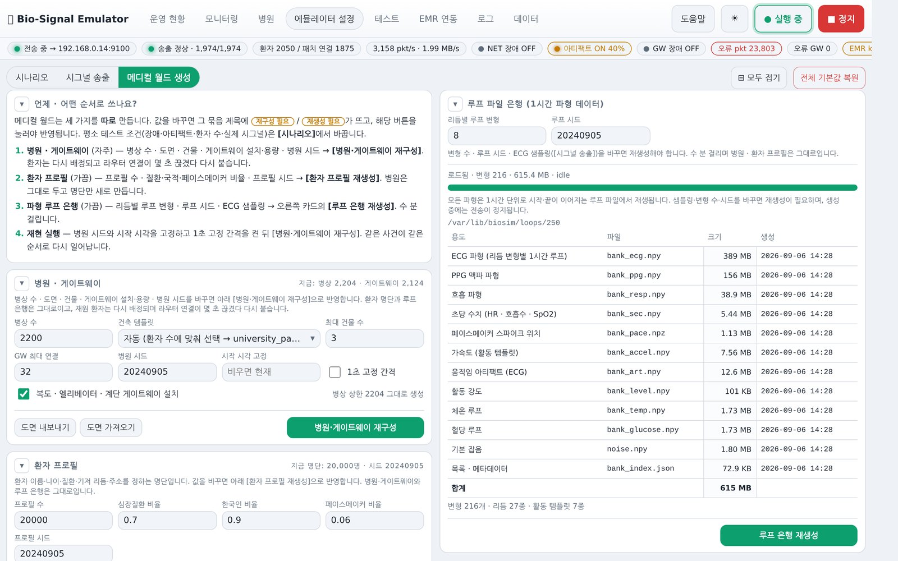

**메디컬 월드 생성**
병원·게이트웨이, 환자 프로필, 1시간 신호 루프 은행을 따로 다시 만들 수 있습니다.

---

## 9. 현장 테스트

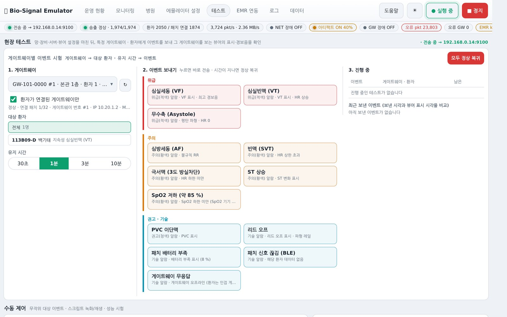

망·장비·서버·뷰어를 설치한 뒤, 특정 게이트웨이·환자에게 이벤트를 보내 그 게이트웨이를 보는 뷰어의 표시와 경보음을 현장에서 확인합니다.
- 이벤트는 13종이며 우선순위가 셋입니다.
  - 위급(적색): 심실세동, VT, 무수축
  - 주의(황색): 심방세동, SVT, 3도 차단, ST 상승, SpO₂ 저하
  - 권고·기술: PVC 이단맥, 리드오프, 패치 배터리 부족, BLE 신호 끊김, 게이트웨이 무응답
- 이벤트는 지정한 시간 동안 유지된 뒤 정상으로 돌아옵니다.

---

## 10. 데이터 · 로그 · 병원 목록

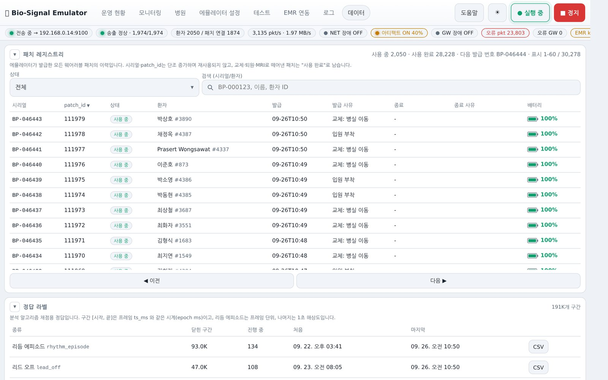

**데이터**
- 발급된 모든 패치의 레지스트리: 시리얼·patch_id는 재사용하지 않고, 발급·종료 시각과 사유가 남습니다.
- 정답 라벨 요약, 설정 이력, SQLite 조회 콘솔을 제공합니다.

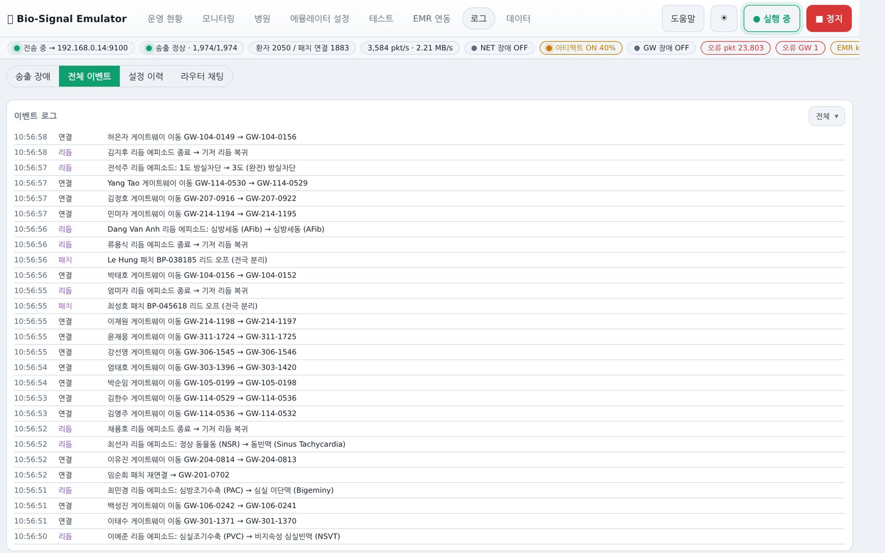

**로그**
송출 장애, 전체 이벤트, 설정 이력, 라우터와의 채팅을 하위 보기로 나눠 봅니다.

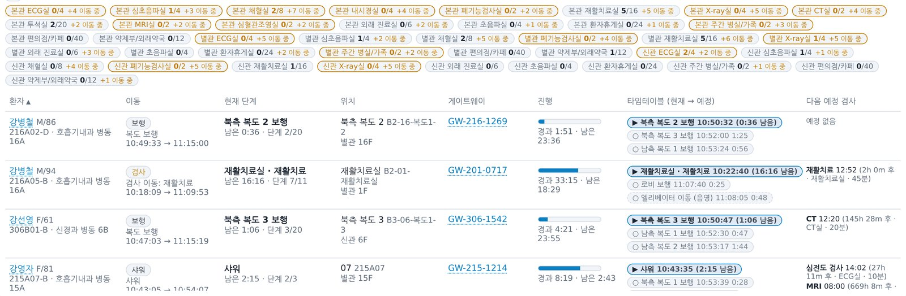

**병원 목록**
이동 중 환자 목록은 검사·방문 동선을 단계별 타임테이블로 보여 줍니다. 게이트웨이 목록과 병동 목록이 함께 있습니다.

---

## 11. 프로토콜 · 시작 매뉴얼

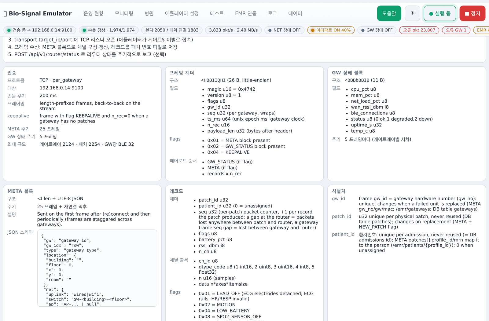

진입점 API(`GET /api/v1`)가 프로토콜·채널·엔드포인트·현재 설정을 기계가독 형태로 제공합니다. 라우터는 이 문서만 읽고 수신을 시작할 수 있습니다.

**전송 프로토콜 요약**

| 구성 | 크기 | 내용 |
|---|---|---|
| 프레임 헤더 | 26 B | magic 0x4742 · 버전 · flags · gw_id · 프레임 순번 · 시각(ms) · 레코드 수 · 길이 |
| GW 상태 | 11 B | CPU·메모리·망 부하, WAN RSSI, BLE 연결 수, 상태, uptime, 온도 (5프레임마다) |
| META | JSON | 채널 구성, 패치↔환자 매핑, 기기 세트, 페이스메이커 (25프레임마다·재연결 직후) |
| 레코드 | 16 B + 채널 | patch_id · 환자번호 · 패치 순번 · flags · 배터리 · RSSI · 채널들 |
| 트레일러 | 4 B | CRC-32 (불일치 시 재동기화·NACK 재전송) |

채널은 모두 10개입니다.

| 채널 | 형식 |
|---|---|
| ECG | 250/500 Hz · 0.001 mV |
| HR · RR · SpO₂ | 초당 1회 |
| 체온 | 0.01 °C |
| 혈당 | 0.1 mg/dL |
| 가속도 XYZ | 50 Hz |
| PPG | 100 Hz |
| 호흡 파형 | 25 Hz |
| 페이스 마커 | 이벤트 |

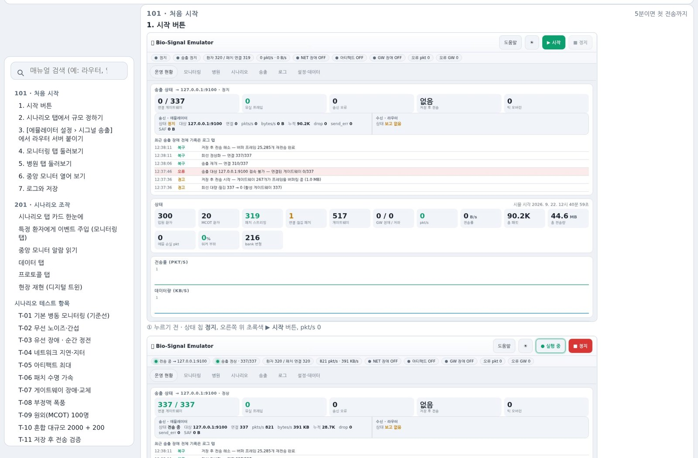

시작 매뉴얼은 101 · 201 · 301 단계별 안내와 시험 항목 T-01~T-14로 이뤄집니다. 항목마다 [이 설정 적용] 버튼이 있습니다.

---

## 주요 사양

| 분류 | 사양 |
|---|---|
| 리듬 | 27종: NSR, 서맥·빈맥, AF·AF RVR·AFL, PVC·이단맥·PAC, NSVT·VT·SVT, 1·2(Mobitz I/II)·3도 AVB, LBBB·RBBB, STEMI·허혈, VVI·AAI·DDD·CRT 페이싱과 오작동, 동정지, VFib |
| 생리 모델 | 호흡–RR–ECG 진폭–PPG 연동, 일주기·다일 드리프트, 1초 크로스페이드 에피소드, 전극 분리·부착 과도 현상 |
| 환자 | 프로필 1만 명, 진단 24종, 동반질환·알레르기·거주지, 삽입형 기기 약 6 % |
| 기기 | ECG 패치 + 체온 패치 + SpO₂(손끝·반지·손목 PTT) + CGM, 증상 맞춤 자동 배정 |
| 패치 | 배터리 15.5일, 최대 착용 14일, 위중도별 처방 3~14일, 교체 시 새 번호 |
| 전송 | 게이트웨이별 TCP, 200 ms 프레임, CRC-32, NACK 재전송(10초 보관), 저장 후 전송(게이트웨이당 2 MB) |
| 검증 | 정답 캡처·대조 도구, 엄격 수신기, 오염 프레임 10종, 연결 폭주·반열림·gw_id 중복 드릴, 정답 라벨(JSON/CSV) |
| EMR | 가상 의료기관 20곳, FHIR R4/STU3 · HL7 v2.3~2.5.1 · CDA R2 · REST · EUC-KR XML, MLLP tcp/2575 |
| 장비 | Raspberry Pi 5 권장 (Pi 4 / reTerminal / Linux / macOS 동작), Python 3.11 · FastAPI · NumPy · SQLite |
| 설치 | 릴리스 tarball + install.sh → systemd 서비스, 키오스크 모드 선택 |
| 포트 | 5445 웹·API · 9100 라우터 수신(대상) · 2575 HL7 MLLP |

## 한계

- ECG는 1채널입니다(다채널·12유도 확장 검토 중).
- BLE 끊김 동안의 패치 내부 저장 후 백필은 아직 손실로만 모델링합니다.
- 전송 구간 TLS·게이트웨이 인증은 없습니다(시험망 전제).
- 원외 환자 위치는 집·외출·음영 상태만 제공합니다.

> **의료 용도 아님** — 시험·개발·교육용 소프트웨어입니다. 신호와 환자·기관 정보는 모두 합성이며 진단이나 치료 판단에 쓰일 수 없습니다. EMR 형식 표기(US Core, SS-MIX2 등)는 표준과 관례를 가리키며 특정 회사와 관계가 없습니다.

---

## 이 폴더의 구성

| 경로 | 내용 |
|---|---|
| `README.md` | 이 문서 (주요 기능 소개) |
| `web/index.html` | 웹사이트용 소개·사양 페이지 (단일 HTML, 밝은/어두운 테마) |
| `images/key/` | 대표 키 스크린 6장 — 원본 PNG (2배 해상도, 약 2,800 px) |
| `images/screens/` | 주요 화면 13장 — 원본 PNG |
| `images/web/` | 웹 게시용 JPG (가로 1,600 px, 150~380 KB) — 본 문서가 참조 |

| 파일 | 화면 | 권장 용도 |
|---|---|---|
| 01_dashboard | 운영 현황 | 첫 화면·대표 이미지 |
| 02_hospital_floorplan | 병원 건축 도면 + 측면도 | 기능 소개(병원 모델) |
| 03_central_station_3x3 | 중앙 모니터 9분할 | 대표 이미지(어두운 배경) |
| 04_bedside_viewer | 단일 침상 뷰어 | 기능 소개(모니터링) |
| 05_monitoring_patient | 환자 목록·실시간 신호 | 기능 소개(환자·처방) |
| 06_emr_integration | EMR 연동 20곳 | 기능 소개(EMR) |
| 07_floorplan_room_zoom | 병실 확대 | 상세(침대·게이트웨이) |
| 08_central_station_24 | 중앙 모니터 24분할 | 상세 |
| 09_numeric_board_96 | 숫자 전용 보드 | 상세 |
| 10_scenario_presets | 시나리오 프리셋 | 상세 |
| 11_signal_tx | 시그널 송출 | 상세 |
| 12_medical_world | 메디컬 월드 생성 | 상세 |
| 13_field_test | 현장 테스트 | 상세 |
| 14_data_registry | 패치 레지스트리·데이터 | 상세 |
| 15_event_log | 이벤트 로그 | 상세 |
| 16_protocol | 프로토콜 | 기술 문서 |
| 17_start_manual | 시작 매뉴얼 | 기술 문서 |
| 18_hospital_lists | 이동 중 환자·게이트웨이 목록 | 상세 |
| 19_emr_site_detail | EMR 기관 상세·예시 요청 | 기술 문서 |

캡처: 2026-09-26 운영 장비, 1440×900 화면을 2배 해상도로, 밝은 테마. 화면 속 환자·기관·번호는 모두 합성 데이터입니다.
